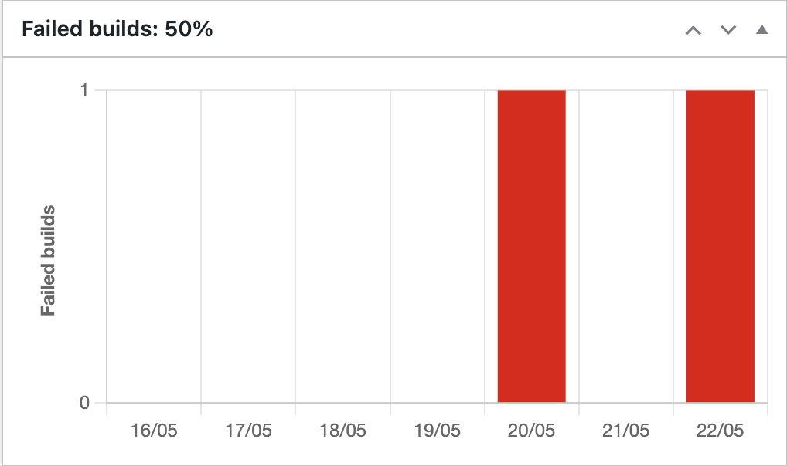
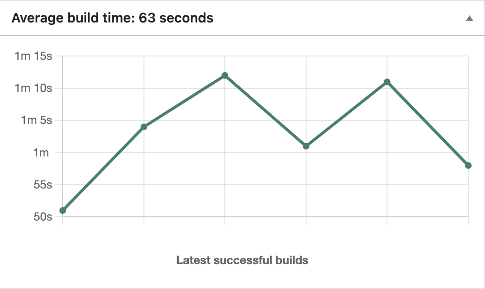

<h1 align="center">Vercel Builds Widget</h1>
<br />
<p align="center">
  <a href="https://github.com/TimeZHero/vercel-builds-widget">
    
    
  </a>

## Install

1. Add the following into your composer.json `repositories` key

```
{ 
    "type": "github", 
    "url": "https://github.com/TimeZHero/vercel-builds-widget" 
}
```

1. Run `composer require "timezhero/vercel-builds-widget"`
2. Install and activate <a href='https://github.com/TimeZHero/wp-vercel-builds/'>the vercel builds plugin</a>
3. Install and activate <a href='https://wordpress.org/plugins/simple-charts/'>the simple chart plugin</a>
4. Activate this plugin and check out your dashboard tab
